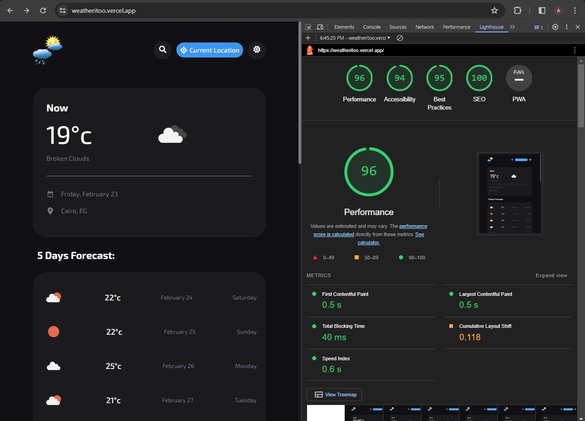

# Weather Dashborad Application

### Overview

This is a Weather Dashboard application designed to provide users with up-to-date and comprehensive weather information. With its user-friendly interface and intuitive design, the dashboard offers a range of features to help users stay informed about current conditions and forecasts.

### Built with

- ReactJs
- CSS Modules
- RESTful API
- Context API
- Vite
- ESLint and Prettier for code linting and formatting
- Designed also by me

### Screenshot

